# System Architecture

## High-Level Architecture

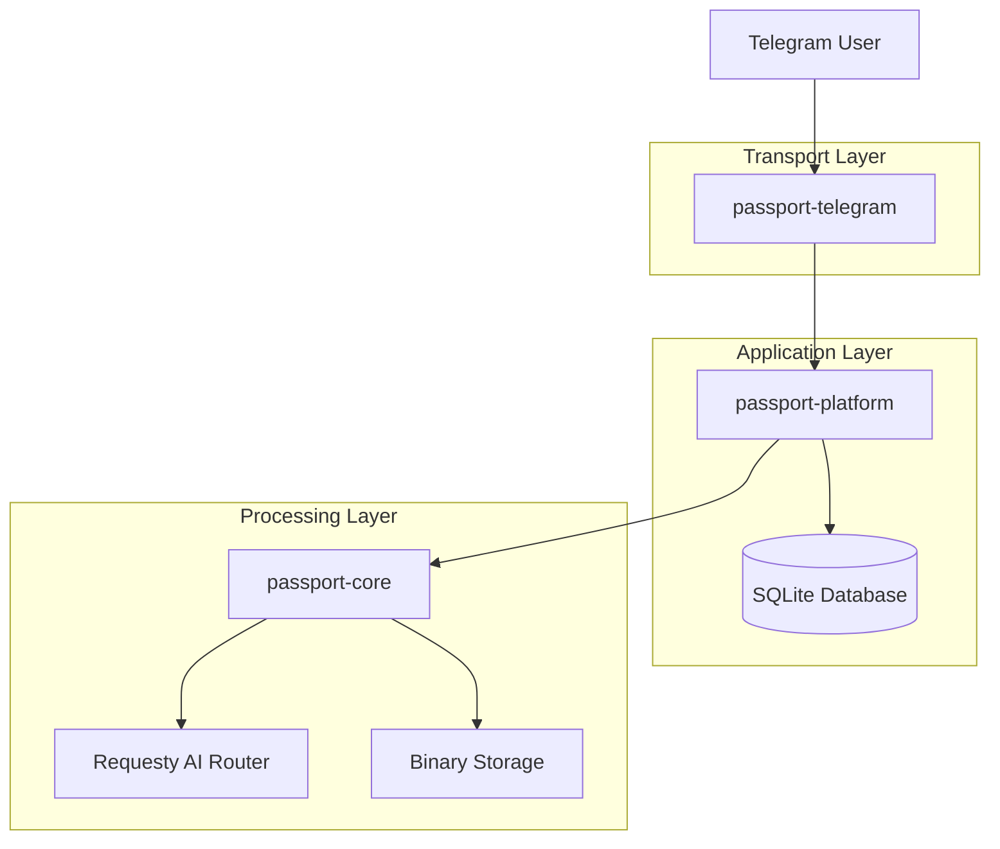

## Package Dependencies

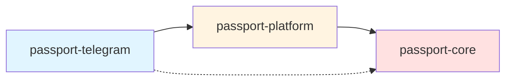

## Processing Workflow

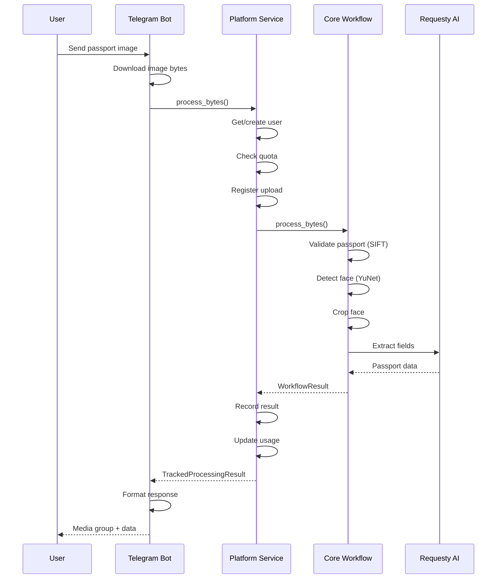

## Deployment Architecture

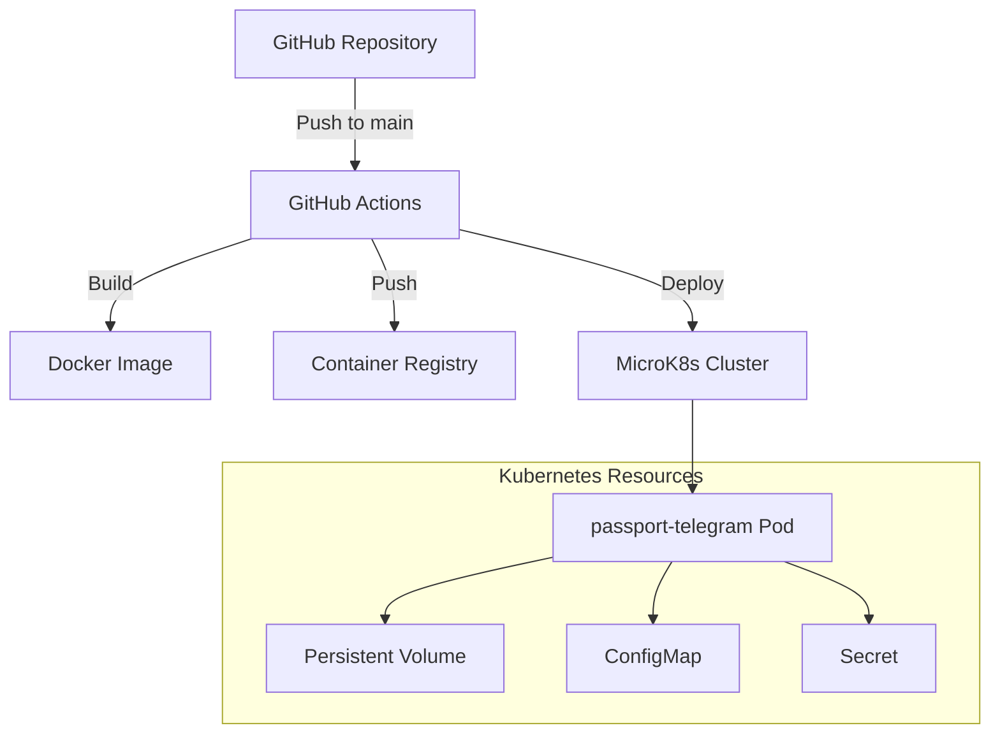

## Data Flow Architecture

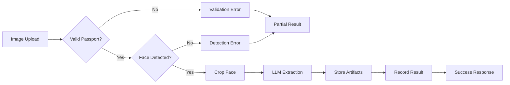

## Storage Architecture

### Binary Storage (passport-core)

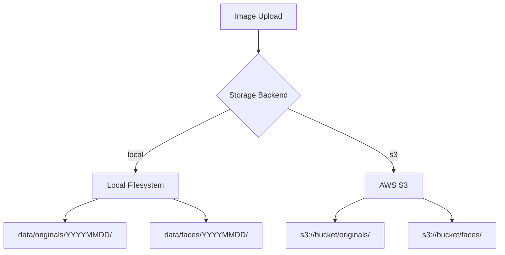

### Result Storage (passport-core)

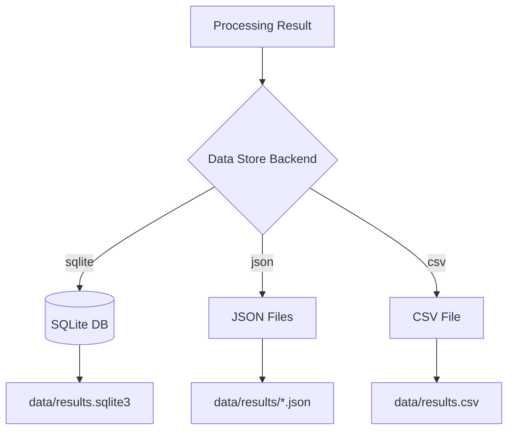

### Application Database (passport-platform)

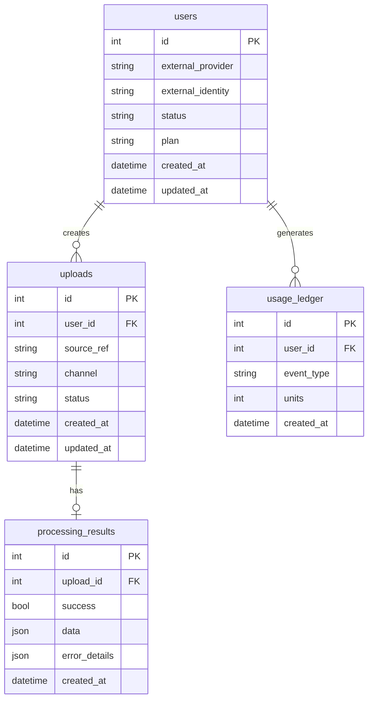

## Security Architecture

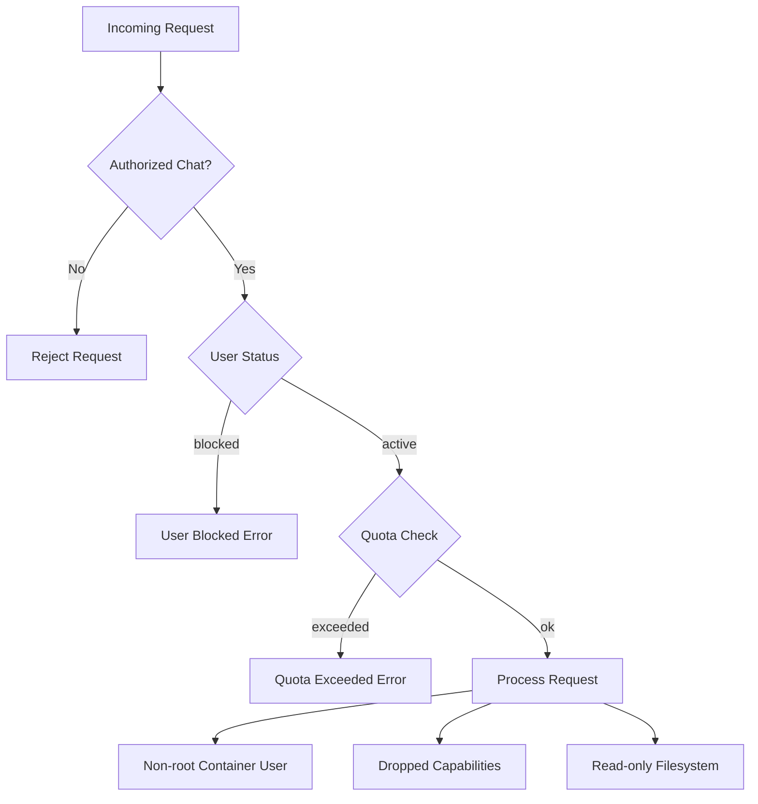

## Configuration Architecture

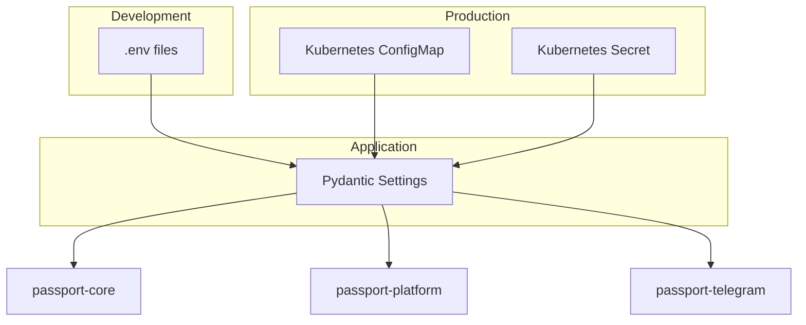

## Error Handling Architecture

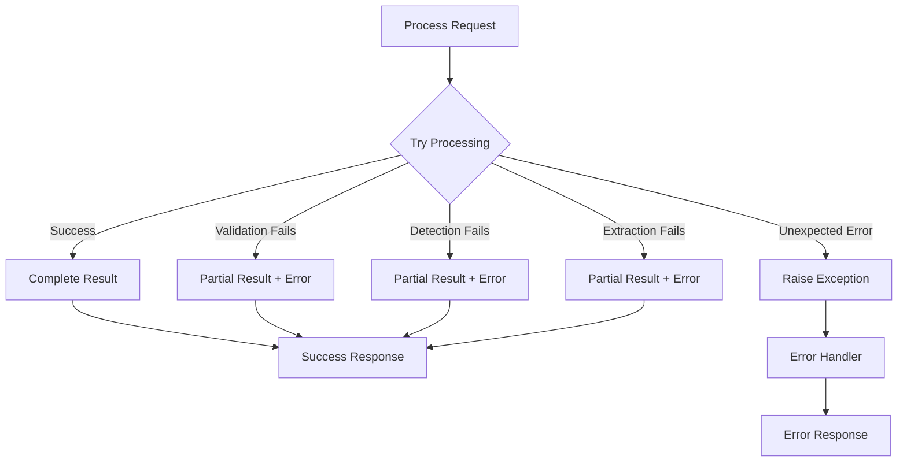

## Scaling Considerations

### Current Architecture (Single Replica)
- Telegram bot uses long polling (no webhook)
- Single pod deployment with Recreate strategy
- Persistent volume for data storage
- Suitable for low-to-medium traffic

### Future Scaling Options
1. **Horizontal Scaling**
   - Switch to webhook mode for Telegram
   - Multiple replicas with load balancing
   - Shared storage (S3 or NFS)
   - Distributed database (PostgreSQL)

2. **Vertical Scaling**
   - Increase pod resources (CPU/memory)
   - Optimize image processing pipeline
   - Cache LLM responses

3. **Service Separation**
   - Separate processing workers
   - Queue-based architecture (Redis/RabbitMQ)
   - Async processing with status callbacks

## Design Patterns

### Adapter Pattern
- `passport-telegram` and future `passport-api` adapt different transports
- Both use `passport-platform` services
- Core processing logic remains transport-agnostic

### Service Layer Pattern
- Clear separation between transport, application, and processing layers
- Services encapsulate business logic
- Repositories handle data access

### Workflow Pattern
- `PassportWorkflow` provides stage-by-stage processing
- Each stage can be called independently
- Partial results returned on failure

### Repository Pattern
- Data access abstracted through repositories
- Services depend on repositories, not direct database access
- Easier testing with fake implementations

### Settings Pattern
- Pydantic-based configuration
- Environment variable loading
- Type-safe settings with validation
