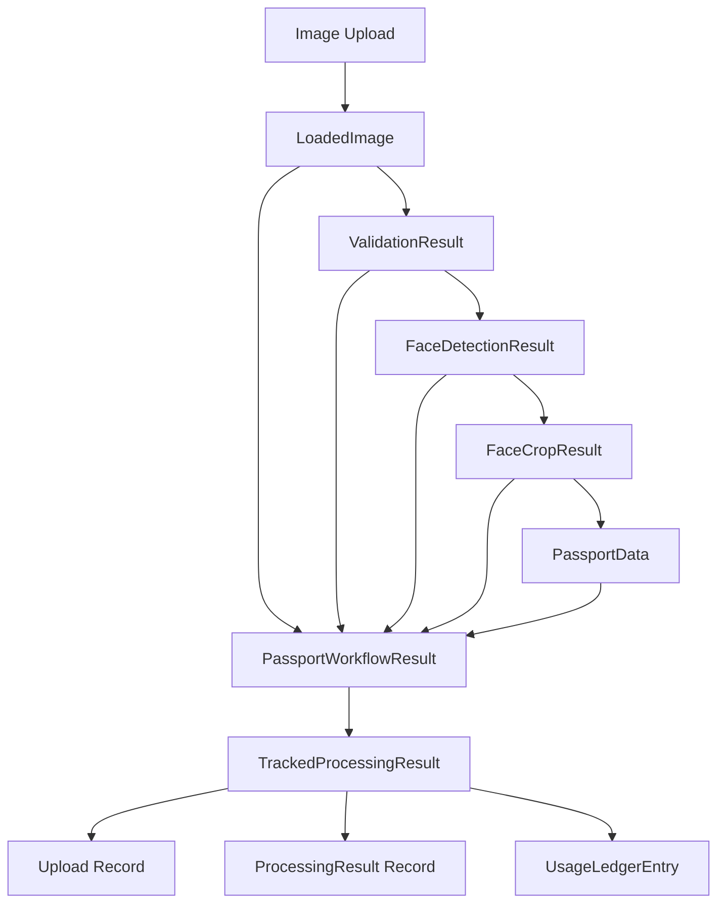
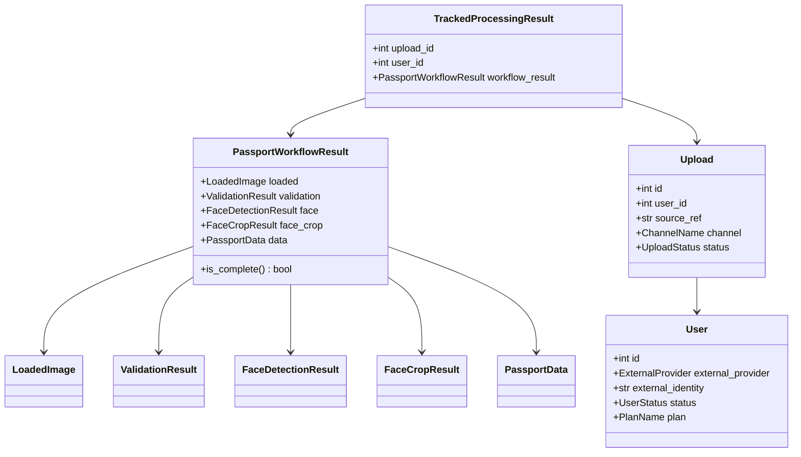

# Data Models

## passport-core Models

### PassportData
**Purpose**: Structured passport field data extracted by LLM

```python
class PassportData(BaseModel):
    PassportNumber: str | None = None
    CountryCode: str | None = None
    MrzLine1: str | None = None
    MrzLine2: str | None = None
    SurnameAr: str | None = None
    GivenNamesAr: str | None = None
    SurnameEn: str | None = None
    GivenNamesEn: str | None = None
    DateOfBirth: str | None = None  # YYYY-MM-DD
    PlaceOfBirthAr: str | None = None
    PlaceOfBirthEn: str | None = None
    Sex: str | None = None  # M or F
    DateOfIssue: str | None = None  # YYYY-MM-DD
    DateOfExpiry: str | None = None  # YYYY-MM-DD
    ProfessionAr: str | None = None
    ProfessionEn: str | None = None
    IssuingAuthorityAr: str | None = None
    IssuingAuthorityEn: str | None = None
```

**Normalization Rules**:
- Dates: Converted to ISO format (YYYY-MM-DD)
- Sex: Normalized to "M" or "F"
- All fields optional (None if not found)

---

### BoundingBox
**Purpose**: Face detection bounding box coordinates

```python
@dataclass
class BoundingBox:
    x: int
    y: int
    width: int
    height: int
```

**Usage**: Represents face location in original image coordinates

---

### ValidationResult
**Purpose**: Passport validation outcome

```python
@dataclass
class ValidationResult:
    is_passport: bool
    match_count: int
    page_quad: tuple[tuple[int, int], ...] | None
```

**Fields**:
- `is_passport`: True if validation passed
- `match_count`: Number of SIFT feature matches
- `page_quad`: Detected passport page corners (4 points)

---

### ValidationDebug
**Purpose**: Detailed validation metrics (internal)

```python
@dataclass
class ValidationDebug:
    keypoints_template: int
    keypoints_input: int
    matches_raw: int
    matches_filtered: int
    match_count: int
    is_passport: bool
```

---

### FaceDetectionResult
**Purpose**: Face detection outcome

```python
@dataclass
class FaceDetectionResult:
    bbox_original: BoundingBox
    confidence: float
```

**Fields**:
- `bbox_original`: Face location in original image
- `confidence`: Detection confidence score (0-1)

---

### FaceCropResult
**Purpose**: Cropped face image data

```python
@dataclass
class FaceCropResult:
    image_bytes: bytes
    width: int
    height: int
    mime_type: str
```

**Fields**:
- `image_bytes`: JPEG-encoded face image
- `width`: Crop width in pixels
- `height`: Crop height in pixels
- `mime_type`: Always "image/jpeg"

---

### LoadedImage
**Purpose**: Loaded image metadata

```python
@dataclass
class LoadedImage:
    source: str
    filename: str
    mime_type: str
    width: int
    height: int
    image_bgr: np.ndarray
```

**Fields**:
- `source`: Original source path/URL
- `filename`: Extracted filename
- `mime_type`: Detected MIME type
- `width`: Image width
- `height`: Image height
- `image_bgr`: OpenCV BGR array

---

### PassportWorkflowResult
**Purpose**: Unified workflow result with all stages

```python
@dataclass
class PassportWorkflowResult:
    source: str
    filename: str
    mime_type: str
    image_bytes: bytes
    loaded: LoadedImage | None
    validation: ValidationResult | None
    face: FaceDetectionResult | None
    face_crop: FaceCropResult | None
    data: PassportData | None
    
    @property
    def is_complete(self) -> bool:
        """True when validation, face crop, and extraction all succeed"""
        return (
            self.validation is not None
            and self.validation.is_passport
            and self.face_crop is not None
            and self.data is not None
        )
    
    @property
    def has_face_crop(self) -> bool:
        return self.face_crop is not None
    
    @property
    def face_crop_bytes(self) -> bytes | None:
        return self.face_crop.image_bytes if self.face_crop else None
```

---

### PassportProcessingResult (Internal CLI)
**Purpose**: Persisted processing result with storage URIs

```python
class PassportProcessingResult(BaseModel):
    id: str
    source: str
    filename: str
    mime_type: str
    original_uri: str | None
    face_crop_uri: str | None
    validation: ValidationResult | None
    face: FaceDetectionResult | None
    data: PassportData | None
    error_details: list[ProcessingError]
    created_at: datetime
```

---

### ProcessingError (Internal CLI)
**Purpose**: Structured error information

```python
class ProcessingError(BaseModel):
    code: ErrorCode
    stage: str
    message: str
    retryable: bool
```

**Error Codes**:
- `INPUT_LOAD_ERROR`
- `STORAGE_ERROR`
- `VALIDATION_ERROR`
- `FACE_DETECTION_ERROR`
- `EXTRACTION_ERROR`
- `INTERNAL_ERROR`

---

## passport-platform Models

### User
**Purpose**: User account with external identity mapping

```python
@dataclass
class User:
    id: int
    external_provider: ExternalProvider
    external_identity: str
    status: UserStatus
    plan: PlanName
    created_at: datetime
    updated_at: datetime
```

**Enums**:
```python
class ExternalProvider(str, Enum):
    TELEGRAM = "telegram"
    API = "api"

class UserStatus(str, Enum):
    ACTIVE = "active"
    BLOCKED = "blocked"

class PlanName(str, Enum):
    FREE = "free"
    PRO = "pro"
    ENTERPRISE = "enterprise"
```

---

### Upload
**Purpose**: Upload tracking record

```python
@dataclass
class Upload:
    id: int
    user_id: int
    source_ref: str
    channel: ChannelName
    status: UploadStatus
    created_at: datetime
    updated_at: datetime
```

**Enums**:
```python
class ChannelName(str, Enum):
    TELEGRAM = "telegram"
    API = "api"

class UploadStatus(str, Enum):
    PENDING = "pending"
    PROCESSING = "processing"
    COMPLETE = "complete"
    FAILED = "failed"
```

---

### ProcessingResult
**Purpose**: Stored processing outcome

```python
@dataclass
class ProcessingResult:
    id: int
    upload_id: int
    success: bool
    data: dict | None  # PassportData as JSON
    error_details: list[dict] | None  # ProcessingError list as JSON
    created_at: datetime
```

---

### RecordedProcessing
**Purpose**: Processing result with upload metadata

```python
@dataclass
class RecordedProcessing:
    upload: Upload
    result: ProcessingResult
```

---

### UsageLedgerEntry
**Purpose**: Usage tracking record

```python
@dataclass
class UsageLedgerEntry:
    id: int
    user_id: int
    event_type: UsageEventType
    units: int
    created_at: datetime
```

**Enums**:
```python
class UsageEventType(str, Enum):
    UPLOAD = "upload"
    SUCCESS = "success"
    TOKENS = "tokens"
```

---

### UsageSummary
**Purpose**: Aggregated usage metrics

```python
@dataclass
class UsageSummary:
    uploads: int
    successes: int
    tokens: int
```

---

### PlanPolicy
**Purpose**: Plan limits and features

```python
@dataclass
class PlanPolicy:
    name: PlanName
    monthly_upload_limit: int | None
    monthly_success_limit: int | None
```

**Policies**:
- **Free**: 10 uploads/month, 5 successes/month
- **Pro**: 100 uploads/month, 50 successes/month
- **Enterprise**: Unlimited (None)

---

### QuotaDecision
**Purpose**: Quota evaluation result

```python
@dataclass
class QuotaDecision:
    can_upload: bool
    uploads_remaining: int | None
    successes_remaining: int | None
    current_usage: UsageSummary
```

---

### TrackedProcessingResult
**Purpose**: Processing result with tracking metadata

```python
@dataclass
class TrackedProcessingResult:
    upload_id: int
    user_id: int
    success: bool
    workflow_result: PassportWorkflowResult
    usage_tokens: int | None
    error_code: str | None
```

---

## passport-platform Schemas (Commands)

### EnsureUserCommand
**Purpose**: Get or create user request

```python
@dataclass
class EnsureUserCommand:
    external_provider: ExternalProvider
    external_identity: str
```

---

### RegisterUploadCommand
**Purpose**: Register upload request

```python
@dataclass
class RegisterUploadCommand:
    user_id: int
    source_ref: str
    channel: ChannelName
```

---

### RecordProcessingResultCommand
**Purpose**: Record processing result request

```python
@dataclass
class RecordProcessingResultCommand:
    upload_id: int
    success: bool
    workflow_result: PassportWorkflowResult
    usage_tokens: int | None
    error_code: str | None = None
```

---

### ProcessUploadCommand
**Purpose**: Complete processing request

```python
@dataclass
class ProcessUploadCommand:
    image_bytes: bytes
    filename: str
    mime_type: str
    source_ref: str
    channel: ChannelName
    external_provider: ExternalProvider
    external_identity: str
```

---

## passport-telegram Models

### TelegramImageUpload
**Purpose**: Telegram-specific upload metadata

```python
@dataclass
class TelegramImageUpload:
    file_id: str
    file_unique_id: str
    width: int
    height: int
    file_size: int | None
    mime_type: str
    filename: str
```

---

### PendingMediaGroup
**Purpose**: Media group collection state

```python
@dataclass
class PendingMediaGroup:
    media_group_id: str
    chat_id: int
    uploads: list[TelegramImageUpload]
    scheduled_at: datetime
```

---

## Database Schema (passport-platform)

### users table
```sql
CREATE TABLE users (
    id INTEGER PRIMARY KEY AUTOINCREMENT,
    external_provider TEXT NOT NULL,
    external_identity TEXT NOT NULL,
    status TEXT NOT NULL DEFAULT 'active',
    plan TEXT NOT NULL DEFAULT 'free',
    created_at TEXT NOT NULL,
    updated_at TEXT NOT NULL,
    UNIQUE(external_provider, external_identity)
);

CREATE INDEX idx_users_external ON users(external_provider, external_identity);
CREATE INDEX idx_users_status ON users(status);
```

---

### uploads table
```sql
CREATE TABLE uploads (
    id INTEGER PRIMARY KEY AUTOINCREMENT,
    user_id INTEGER NOT NULL,
    source_ref TEXT NOT NULL UNIQUE,
    channel TEXT NOT NULL,
    status TEXT NOT NULL DEFAULT 'pending',
    created_at TEXT NOT NULL,
    updated_at TEXT NOT NULL,
    FOREIGN KEY (user_id) REFERENCES users(id)
);

CREATE INDEX idx_uploads_user_id ON uploads(user_id);
CREATE INDEX idx_uploads_source_ref ON uploads(source_ref);
CREATE INDEX idx_uploads_status ON uploads(status);
CREATE INDEX idx_uploads_created_at ON uploads(created_at);
```

---

### processing_results table
```sql
CREATE TABLE processing_results (
    id INTEGER PRIMARY KEY AUTOINCREMENT,
    upload_id INTEGER NOT NULL UNIQUE,
    success INTEGER NOT NULL,
    data TEXT,
    error_details TEXT,
    created_at TEXT NOT NULL,
    FOREIGN KEY (upload_id) REFERENCES uploads(id)
);

CREATE INDEX idx_processing_results_upload_id ON processing_results(upload_id);
CREATE INDEX idx_processing_results_success ON processing_results(success);
```

---

### usage_ledger table
```sql
CREATE TABLE usage_ledger (
    id INTEGER PRIMARY KEY AUTOINCREMENT,
    user_id INTEGER NOT NULL,
    event_type TEXT NOT NULL,
    units INTEGER NOT NULL,
    created_at TEXT NOT NULL,
    FOREIGN KEY (user_id) REFERENCES users(id)
);

CREATE INDEX idx_usage_ledger_user_id ON usage_ledger(user_id);
CREATE INDEX idx_usage_ledger_event_type ON usage_ledger(event_type);
CREATE INDEX idx_usage_ledger_created_at ON usage_ledger(created_at);
```

---

## Data Flow Diagram



## Type Relationships


