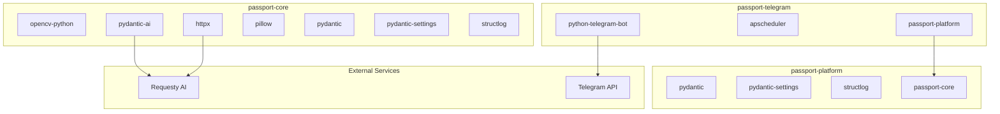

# Dependencies

## External Dependencies

### passport-core

#### Production Dependencies

**opencv-python** (4.10.0+)
- Purpose: Image processing, SIFT feature detection, face detection
- Usage: Passport validation, face detection with YuNet model
- Critical: Yes - Core functionality depends on it

**pydantic-ai** (0.0.14+)
- Purpose: LLM integration framework
- Usage: Structured extraction with Requesty AI router
- Critical: Yes - Required for field extraction

**httpx** (0.27.0+)
- Purpose: HTTP client for async/sync requests
- Usage: Remote image loading, Requesty API calls
- Critical: Yes - Required for LLM and remote images

**pillow** (10.4.0+)
- Purpose: Image encoding/decoding
- Usage: JPEG encoding, image format detection
- Critical: Yes - Required for image handling

**python-dotenv** (1.0.1+)
- Purpose: Environment variable loading
- Usage: Load .env files for configuration
- Critical: No - Can use system env vars

**pydantic** (2.9.0+)
- Purpose: Data validation and settings
- Usage: Settings management, model validation
- Critical: Yes - Required for configuration

**pydantic-settings** (2.5.2+)
- Purpose: Settings management from environment
- Usage: Load settings from env vars
- Critical: Yes - Required for configuration

**structlog** (24.4.0+)
- Purpose: Structured logging
- Usage: JSON logging, log context binding
- Critical: No - Can use standard logging

#### Development Dependencies

**pytest** (8.3.2+)
- Purpose: Testing framework
- Usage: Unit tests, integration tests, fixtures

**ruff** (0.6.3+)
- Purpose: Fast Python linter
- Usage: Code quality checks, formatting

**pyright** (1.1.377+)
- Purpose: Static type checker
- Usage: Type checking via `ty` alias

---

### passport-platform

#### Production Dependencies

**pydantic** (2.9.0+)
- Purpose: Data validation and models
- Usage: Model definitions, validation
- Critical: Yes - Core data models

**pydantic-settings** (2.5.2+)
- Purpose: Settings management
- Usage: Environment-based configuration
- Critical: Yes - Required for configuration

**structlog** (24.4.0+)
- Purpose: Structured logging
- Usage: Application logging
- Critical: No - Can use standard logging

**passport-core** (local)
- Purpose: Passport processing engine
- Usage: Workflow execution
- Critical: Yes - Core processing dependency

#### Development Dependencies

**pytest** (8.3.2+)
- Purpose: Testing framework
- Usage: Service and repository tests

**ruff** (0.6.3+)
- Purpose: Linter and formatter
- Usage: Code quality

---

### passport-telegram

#### Production Dependencies

**python-telegram-bot** (21.5+)
- Purpose: Telegram Bot API wrapper
- Usage: Bot handlers, message sending, file downloads
- Critical: Yes - Core bot functionality

**apscheduler** (3.10.4+)
- Purpose: Job scheduling
- Usage: Media group collection timeouts
- Critical: Yes - Required for batching

**passport-core** (local)
- Purpose: Passport processing
- Usage: Workflow execution
- Critical: Yes - Processing dependency

**passport-platform** (local)
- Purpose: Application services
- Usage: User management, quotas, uploads
- Critical: Yes - Application layer dependency

#### Development Dependencies

**pytest** (8.3.2+)
- Purpose: Testing framework
- Usage: Bot handler tests

**ruff** (0.6.3+)
- Purpose: Linter
- Usage: Code quality

---

## System Dependencies

### Runtime Requirements

**Python 3.12+**
- Required for all packages
- Uses modern type hints and features

**SQLite 3**
- Embedded database for passport-platform
- No separate installation needed (included with Python)

**libgomp1** (Linux)
- OpenMP library for OpenCV
- Required in Docker containers
- Install: `apt-get install libgomp1`

---

## Development Tools

**uv** (0.4.0+)
- Fast Python package manager
- Alternative to pip
- Usage: `uv sync`, `uv run`

**Docker** (20.10+)
- Container runtime
- Required for building and running containers

**MicroK8s** (1.28+)
- Lightweight Kubernetes
- Required for deployment

**kubectl**
- Kubernetes CLI
- Included with MicroK8s: `microk8s kubectl`

**git**
- Version control
- Required for CI/CD

---

## External Services

### Requesty AI Router
- **Purpose**: LLM routing and inference
- **Endpoint**: `https://router.requesty.ai/v1`
- **Authentication**: API key via `PASSPORT_REQUESTY_API_KEY`
- **Models Supported**:
  - OpenAI: gpt-5-mini, gpt-4o, etc.
  - Google: gemini-3.1-flash-lite-preview, etc.
  - Anthropic: claude-3-5-sonnet, etc.
- **Usage**: Passport field extraction
- **Critical**: Yes - Required for extraction

### Telegram Bot API
- **Purpose**: Bot messaging and file handling
- **Endpoint**: `https://api.telegram.org`
- **Authentication**: Bot token via `PASSPORT_TELEGRAM_BOT_TOKEN`
- **Usage**: Receive images, send responses
- **Critical**: Yes - Required for Telegram adapter

### Container Registry
- **Purpose**: Docker image storage
- **Endpoint**: `registry.mohammed-alkebsi.dev`
- **Authentication**: Registry credentials
- **Usage**: Store and pull production images
- **Critical**: Yes - Required for deployment

---

## Asset Dependencies

### passport-core Assets

**passport_template_v2.jpg**
- Purpose: Reference template for SIFT validation
- Location: `passport-core/assets/`
- Size: ~1.1 MB
- Critical: Yes - Required for validation

**face_detection_yunet_2023mar.onnx**
- Purpose: YuNet face detection model
- Location: `passport-core/assets/`
- Size: ~233 KB
- Format: ONNX
- Critical: Yes - Required for face detection

**pricing.json**
- Purpose: Model pricing metadata for benchmarking
- Location: `passport-core/assets/`
- Size: ~215 bytes
- Critical: No - Only for benchmarking

---

## Dependency Graph



---

## Version Constraints

### Python Version
- **Minimum**: 3.12
- **Recommended**: 3.12.x
- **Reason**: Modern type hints, performance improvements

### Key Package Versions

**opencv-python**
- Constraint: `>=4.10.0`
- Reason: YuNet face detector support

**pydantic-ai**
- Constraint: `>=0.0.14`
- Reason: Requesty integration features

**python-telegram-bot**
- Constraint: `>=21.5`
- Reason: Modern async API

**pydantic**
- Constraint: `>=2.9.0`
- Reason: Modern validation features

---

## Dependency Installation

### Using uv (Recommended)

```bash
# passport-core
cd passport-core
uv sync --extra dev

# passport-platform
cd passport-platform
uv sync --extra dev

# passport-telegram
cd passport-telegram
uv sync --extra dev
```

### Using pip

```bash
# passport-core
cd passport-core
pip install -e '.[dev]'

# passport-platform
cd passport-platform
pip install -e '.[dev]'

# passport-telegram
cd passport-telegram
pip install -e '.[dev]'
```

---

## Docker Dependencies

### Base Image
- **Image**: `python:3.12-slim`
- **Purpose**: Minimal Python runtime
- **Size**: ~130 MB

### Build Dependencies
- **uv**: Installed in builder stage
- **Purpose**: Fast package installation

### Runtime Dependencies
- **libgomp1**: OpenMP library for OpenCV
- **Install**: `apt-get install -y libgomp1`

---

## Security Considerations

### Dependency Scanning
- Use `pip-audit` or `safety` to scan for vulnerabilities
- Regularly update dependencies
- Monitor security advisories

### API Key Management
- Never commit API keys to git
- Use environment variables or secrets
- Rotate keys regularly

### Container Security
- Use minimal base images
- Run as non-root user
- Drop unnecessary capabilities
- Scan images for vulnerabilities

---

## Dependency Update Strategy

### Regular Updates
- Check for updates monthly
- Test in development first
- Update lock files: `uv lock`

### Security Updates
- Apply immediately
- Test critical paths
- Deploy as hotfix if needed

### Major Version Updates
- Review breaking changes
- Update tests
- Update documentation
- Staged rollout

---

## Troubleshooting Dependencies

### OpenCV Issues
```bash
# Missing libgomp1
apt-get install libgomp1

# SIFT not available
# Use opencv-contrib-python instead of opencv-python
pip install opencv-contrib-python
```

### pydantic-ai Issues
```bash
# API key not set
export PASSPORT_REQUESTY_API_KEY=your_key

# Connection errors
# Check PASSPORT_REQUESTY_BASE_URL
```

### python-telegram-bot Issues
```bash
# Bot token invalid
# Verify PASSPORT_TELEGRAM_BOT_TOKEN

# Connection timeout
# Check network connectivity to api.telegram.org
```

### uv Issues
```bash
# Install uv
curl -LsSf https://astral.sh/uv/install.sh | sh

# Clear cache
uv cache clean

# Reinstall
rm -rf .venv
uv sync
```
