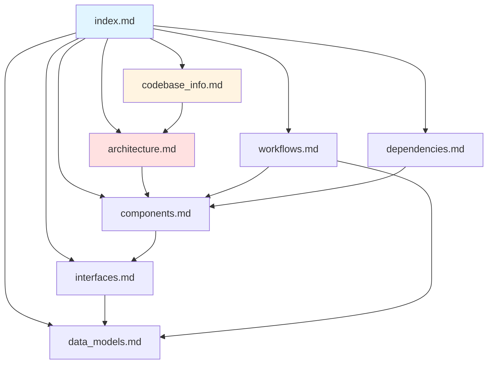

# Documentation Index - Knowledge Base for AI Assistants

## How to Use This Documentation

**For AI Assistants**: This index is designed to be your primary context file. It contains rich metadata about each documentation file, helping you quickly identify which files contain the information needed to answer specific questions. You should:

1. **Start here**: Read this index first to understand the documentation structure
2. **Identify relevant files**: Use the summaries below to determine which files to consult
3. **Dive deeper**: Only read specific documentation files when you need detailed information
4. **Cross-reference**: Use the relationships section to find related information

**For Developers**: This documentation provides comprehensive information about the passport-reader codebase, including architecture, components, APIs, data models, workflows, and dependencies.

---

## Quick Navigation

| Question Type | Consult These Files |
|--------------|---------------------|
| "What does this project do?" | codebase_info.md, architecture.md |
| "How do I set up the project?" | codebase_info.md, dependencies.md |
| "What's the system architecture?" | architecture.md, components.md |
| "How do I use the API?" | interfaces.md, components.md |
| "What data structures are used?" | data_models.md |
| "How does processing work?" | workflows.md, components.md |
| "What are the dependencies?" | dependencies.md |
| "How do I deploy?" | See deployment docs in root directory |

---

## Documentation Files

### codebase_info.md
**Purpose**: High-level project overview and technical context

**Contains**:
- Project description and purpose
- Technology stack (Python 3.12, OpenCV, LLMs, Telegram)
- Repository structure (3 packages: core, platform, telegram)
- Package architecture and responsibilities
- Development tools and testing strategy
- Recent development activity
- Deployment infrastructure overview
- Lines of code and component counts

**When to Use**:
- Getting started with the codebase
- Understanding project scope and goals
- Learning about the technology stack
- Identifying which package handles what functionality

**Key Insights**:
- Three-layer architecture: Transport → Application → Processing
- passport-core: Processing engine (validation, detection, extraction)
- passport-platform: Application services (users, quotas, uploads)
- passport-telegram: Telegram bot adapter
- ~5,920 LOC across 305 functions and 87 classes

---

### architecture.md
**Purpose**: System design, patterns, and architectural decisions

**Contains**:
- High-level architecture diagrams (Mermaid)
- Package dependency graph
- Processing workflow sequence diagrams
- Deployment architecture
- Data flow architecture
- Storage architecture (binary and database)
- Security architecture
- Configuration architecture
- Error handling architecture
- Scaling considerations
- Design patterns used (Adapter, Service Layer, Workflow, Repository)

**When to Use**:
- Understanding system design
- Learning how components interact
- Planning new features or changes
- Troubleshooting integration issues
- Evaluating scaling options

**Key Insights**:
- Clear separation of concerns across layers
- Adapter pattern enables multiple transport mechanisms
- Service layer abstracts business logic
- Workflow pattern provides stage-by-stage processing
- Current deployment: single replica with long polling
- Future scaling: webhooks, horizontal scaling, queue-based processing

---

### components.md
**Purpose**: Detailed component documentation with responsibilities and interfaces

**Contains**:
- passport-core components (Workflow, Validator, Detector, Cropper, Extractor)
- passport-platform components (Services, Repositories)
- passport-telegram components (Bot, Handlers, Formatters)
- Component responsibilities and key methods
- Dependencies between components
- Component interaction patterns
- Testing strategies per component

**When to Use**:
- Understanding specific component functionality
- Learning component APIs and methods
- Identifying component dependencies
- Writing tests for components
- Debugging component behavior

**Key Insights**:
- PassportWorkflow: Public adapter API (use this, not internal pipeline)
- ProcessingService: Orchestrates user/quota/upload tracking
- MediaGroupCollector: Batches Telegram media groups
- Clear separation: Services use Repositories, not direct DB access
- Each component has focused, single responsibility

---

### interfaces.md
**Purpose**: Public and internal APIs, CLI interfaces, and integration points

**Contains**:
- passport-core public API (PassportWorkflow, models, settings)
- passport-platform public API (Services, commands, database)
- passport-telegram API (Bot application, settings)
- Repository interfaces (internal)
- CLI interfaces (passport-core, passport-benchmark, passport-telegram)
- Error interfaces (exception hierarchy)
- Integration points (Requesty AI, Telegram API, SQLite)
- Configuration interfaces (environment variables, K8s)

**When to Use**:
- Learning how to use the APIs
- Understanding method signatures
- Integrating with external services
- Configuring the application
- Handling errors properly

**Key Insights**:
- PassportWorkflow provides both high-level and stage-by-stage APIs
- All packages use Pydantic for settings and validation
- Environment-based configuration with prefixes (PASSPORT_*, PASSPORT_PLATFORM_*, PASSPORT_TELEGRAM_*)
- Requesty AI router supports multiple LLM providers
- Telegram bot uses python-telegram-bot async API

---

### data_models.md
**Purpose**: Data structures, database schema, and type definitions

**Contains**:
- passport-core models (PassportData, ValidationResult, FaceDetectionResult, etc.)
- passport-platform models (User, Upload, ProcessingResult, UsageLedgerEntry)
- passport-telegram models (TelegramImageUpload, PendingMediaGroup)
- Database schema (users, uploads, processing_results, usage_ledger)
- Enums (UserStatus, PlanName, ChannelName, UploadStatus, etc.)
- Data flow diagrams
- Type relationship diagrams

**When to Use**:
- Understanding data structures
- Working with database records
- Validating data formats
- Designing new features
- Debugging data issues

**Key Insights**:
- PassportData: 18 optional fields (Arabic and English variants)
- PassportWorkflowResult: Unified result with all processing stages
- TrackedProcessingResult: Adds tracking metadata to workflow result
- Database uses SQLite with proper indexes
- All dates stored as ISO strings (YYYY-MM-DD)
- Sex normalized to "M" or "F"

---

### workflows.md
**Purpose**: End-to-end processes and operational workflows

**Contains**:
- End-to-end processing workflow (sequence diagram)
- User registration workflow
- Quota evaluation workflow
- Upload processing workflow
- Passport validation workflow
- Face detection workflow
- Face cropping workflow
- LLM extraction workflow
- Media group collection workflow
- Deployment workflow
- Local development workflow
- Testing workflow
- Error handling workflow
- Monitoring workflow
- Backup and recovery workflow

**When to Use**:
- Understanding complete processes
- Tracing request flow
- Debugging multi-step operations
- Planning new workflows
- Onboarding new developers

**Key Insights**:
- Processing is best-effort: partial results returned on failure
- Media groups collected with 2-second window
- Quota checked before processing
- Usage tracked for uploads, successes, and tokens
- Deployment uses GitHub Actions with automated rollout
- Testing follows: unit → contract → integration → lint → type check

---

### dependencies.md
**Purpose**: External dependencies, system requirements, and version constraints

**Contains**:
- Production dependencies per package
- Development dependencies
- System dependencies (Python, SQLite, libgomp1)
- Development tools (uv, Docker, MicroK8s)
- External services (Requesty AI, Telegram API, Container Registry)
- Asset dependencies (models, templates)
- Dependency graph
- Version constraints
- Installation instructions
- Security considerations
- Update strategy
- Troubleshooting guide

**When to Use**:
- Setting up development environment
- Understanding external dependencies
- Troubleshooting installation issues
- Planning dependency updates
- Evaluating security risks

**Key Insights**:
- Python 3.12+ required
- opencv-python: Critical for validation and detection
- pydantic-ai: Critical for LLM extraction
- python-telegram-bot: Critical for Telegram adapter
- uv recommended over pip for faster installs
- Requesty AI router supports multiple LLM providers
- Docker uses multi-stage builds for optimization

---

## Documentation Relationships

---

## Common Queries and File Mapping

### Architecture Questions
- "How is the system structured?" → **architecture.md**
- "What design patterns are used?" → **architecture.md**
- "How do components communicate?" → **architecture.md**, **components.md**

### Component Questions
- "What does PassportWorkflow do?" → **components.md**, **interfaces.md**
- "How does quota checking work?" → **components.md**, **workflows.md**
- "What's the difference between services and repositories?" → **components.md**

### API Questions
- "How do I process a passport image?" → **interfaces.md**, **components.md**
- "What methods does ProcessingService have?" → **interfaces.md**, **components.md**
- "How do I configure the application?" → **interfaces.md**, **dependencies.md**

### Data Questions
- "What fields are extracted from passports?" → **data_models.md**
- "What's the database schema?" → **data_models.md**
- "What enums are available?" → **data_models.md**

### Process Questions
- "How does end-to-end processing work?" → **workflows.md**
- "How are media groups handled?" → **workflows.md**, **components.md**
- "What happens when quota is exceeded?" → **workflows.md**, **components.md**

### Setup Questions
- "How do I set up the project?" → **codebase_info.md**, **dependencies.md**
- "What dependencies are needed?" → **dependencies.md**
- "How do I run tests?" → **codebase_info.md**, **workflows.md**

---

## Documentation Metadata

**Generated**: 2026-03-13  
**Codebase Version**: commit c9b13e4  
**Total Documentation Files**: 7  
**Total Lines**: ~2,500+  
**Coverage**: Architecture, Components, APIs, Data Models, Workflows, Dependencies

---

## Tips for AI Assistants

1. **Start with the index**: This file contains enough metadata to answer many questions without reading other files

2. **Use targeted reading**: Only read specific documentation files when you need detailed information

3. **Follow relationships**: Use the relationships diagram to find related information

4. **Check multiple sources**: Some topics span multiple files (e.g., workflows involve components and data models)

5. **Prioritize recent information**: This documentation reflects the latest codebase state (commit c9b13e4)

6. **Cross-reference with code**: When in doubt, verify documentation against actual code

7. **Update awareness**: This is a snapshot; check for code changes since documentation generation

---

## Tips for Developers

1. **Read codebase_info.md first**: Get the big picture before diving into details

2. **Use architecture.md for design decisions**: Understand the "why" behind the structure

3. **Consult interfaces.md for API usage**: Learn how to use components correctly

4. **Reference data_models.md for data structures**: Understand what data flows through the system

5. **Follow workflows.md for processes**: See how everything fits together

6. **Check dependencies.md for setup**: Get your environment configured correctly

7. **Keep documentation updated**: Update docs when making significant changes
