# Workflows

## End-to-End Processing Workflow

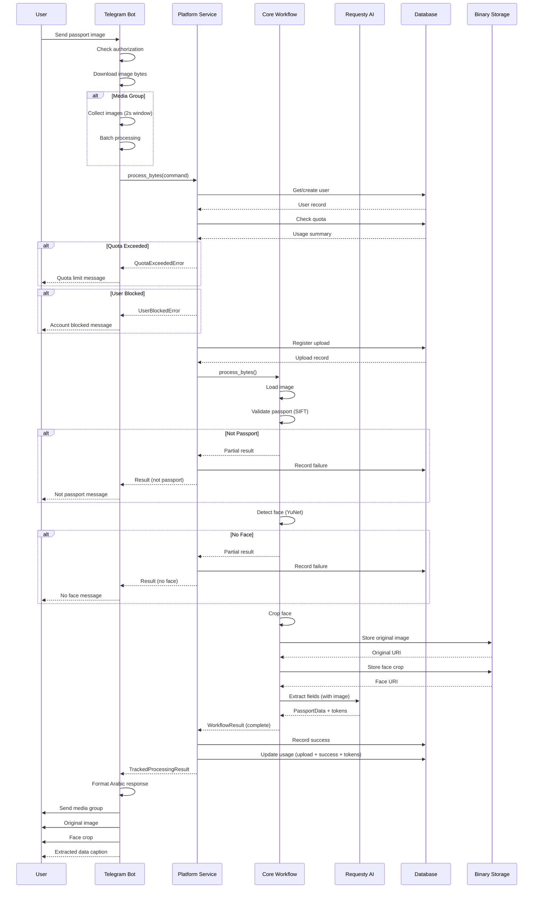

## User Registration Workflow

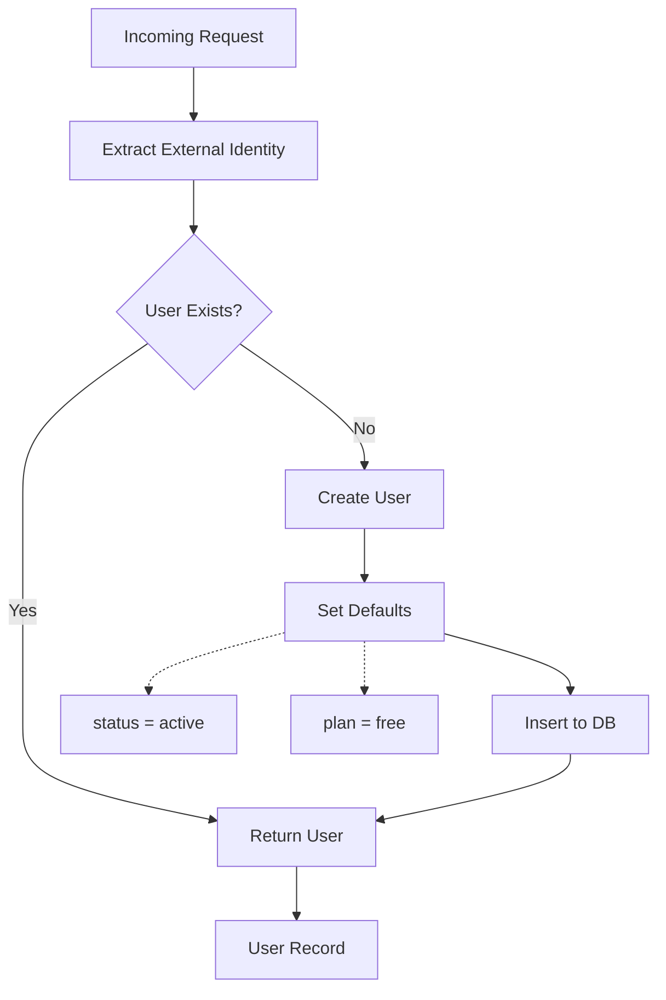

## Quota Evaluation Workflow

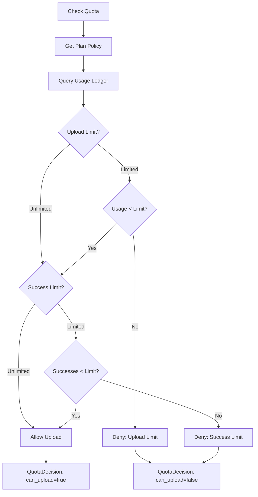

## Upload Processing Workflow

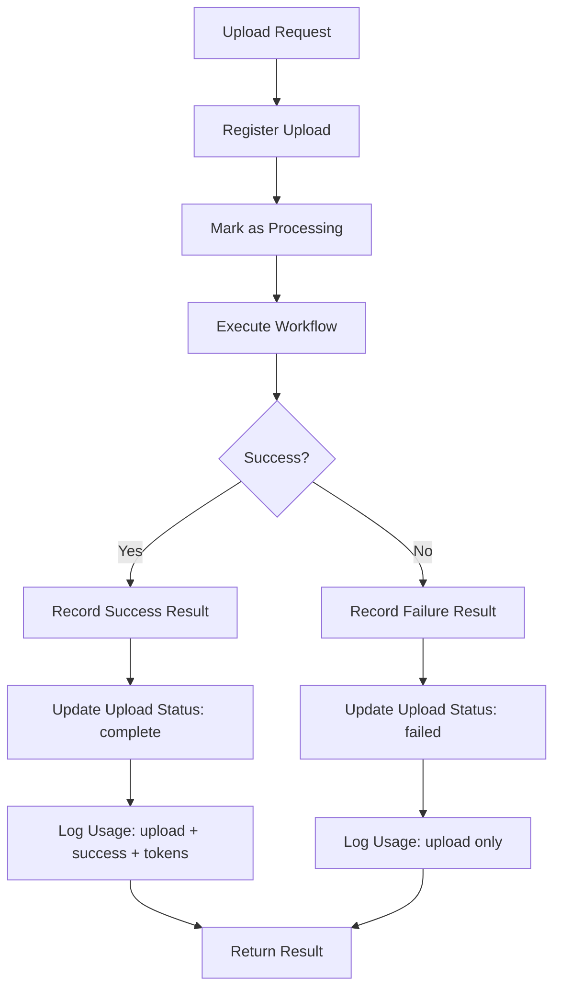

## Passport Validation Workflow

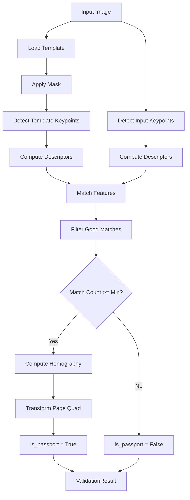

## Face Detection Workflow

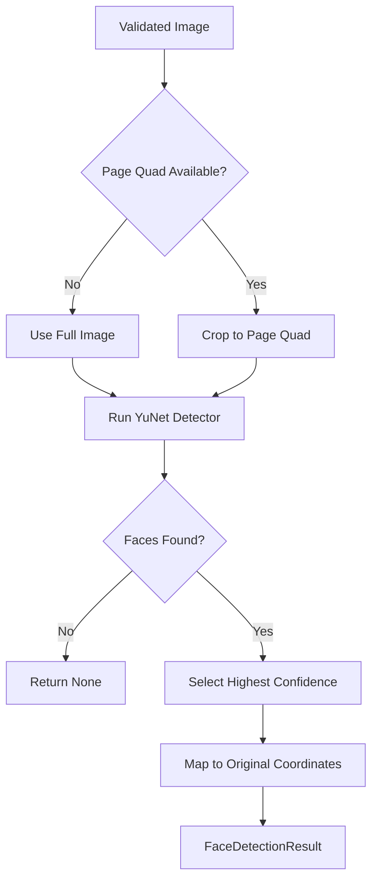

## Face Cropping Workflow

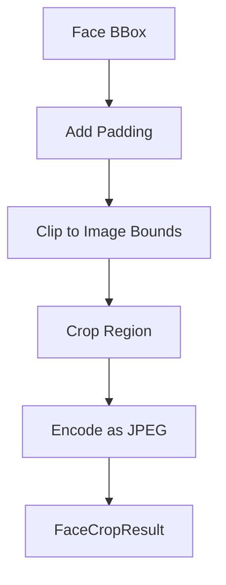

## LLM Extraction Workflow

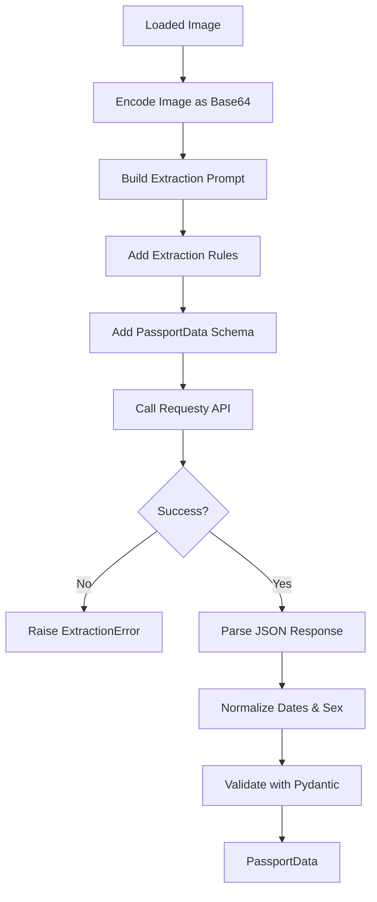

## Media Group Collection Workflow

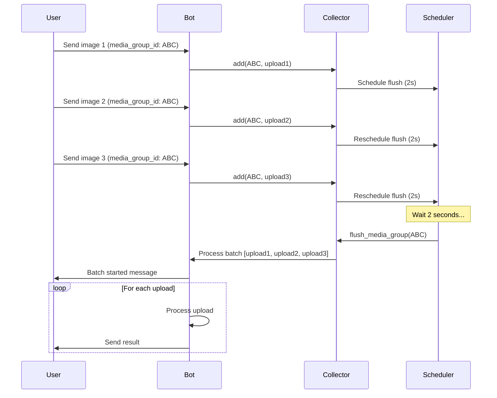

## Deployment Workflow

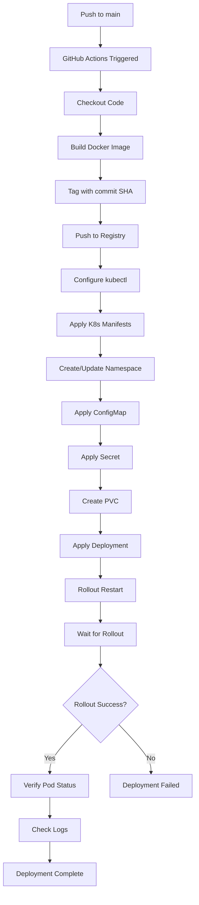

## Local Development Workflow

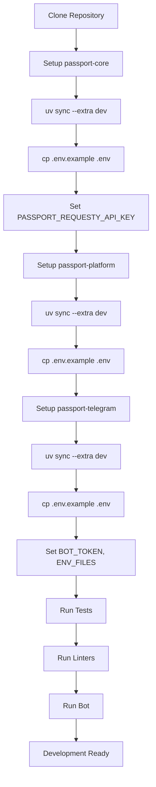

## Testing Workflow

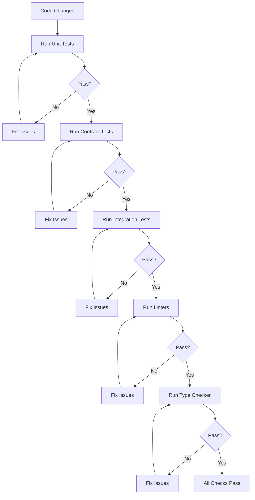

## Error Handling Workflow

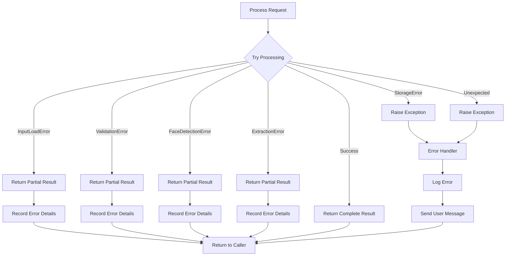

## Monitoring Workflow

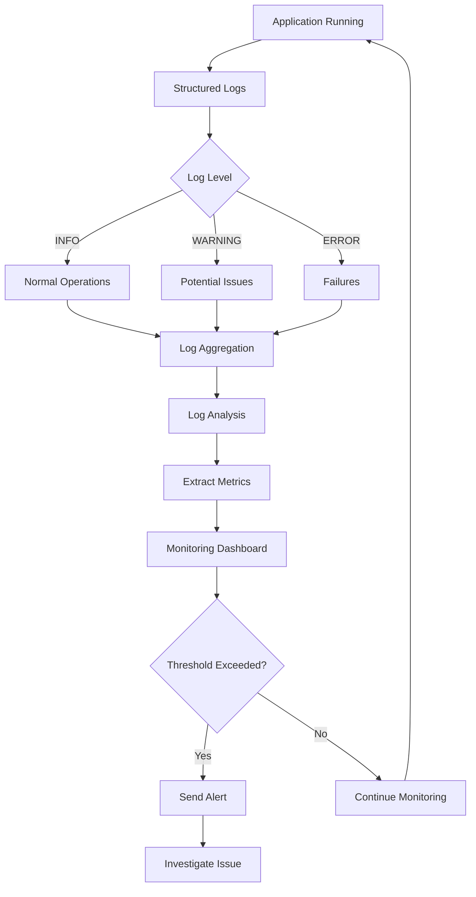

## Backup and Recovery Workflow

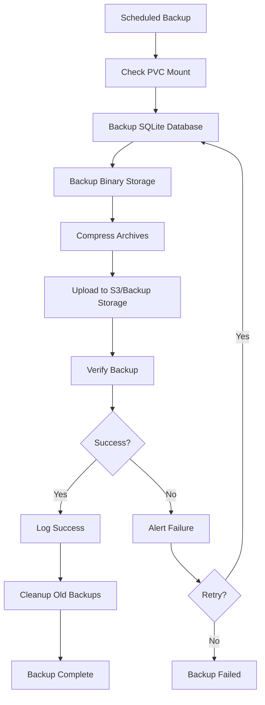
