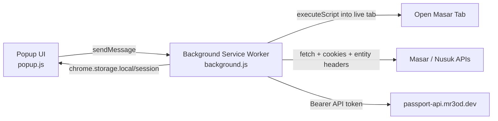

# Passport Masar Extension Architecture

This document is based on direct analysis of the `passport-masar-extension` code currently used in production by agencies.

Scope:
- Analyzed package: `passport-masar-extension`
- Excluded from this document: `.worktrees/extension-wxt-redesign/passport-masar-extension`

The production extension is a Chrome Manifest V3 extension that helps agencies fetch ready passport records from our backend, detect the active Masar context from the browser session, and submit passports into Masar with the correct account and contract context.

Current note about groups:

- the extension has been cleaned of all legacy group selection and assignment logic
- group-related UI (labels, pickers, filters) has been removed from popups and headers
- background submission flows are intentionally group-agnostic to support the primary mutamer creation workflow
- group assignment is considered a separate post-process flow not currently automated by the extension

Current note about context drift:

- explicit session sync from a live Masar tab is used for readiness detector
- entity drift clears stale contract selection and refreshes available contracts
- explicit extension selections remain authoritative
- gated actions enforce context readiness:
  - new batch start
  - single-record submit
  - retry submit
  - details actions use stored submission context and rendered-tab outcome

## 1. System Overview

The extension has two runtime entry points plus helper modules:

1. `background.js`
   - MV3 service worker
   - Owns submission orchestration, Masar API calls, backend API calls, session sync, and cross-screen state coordination
2. `popup.js`
   - Popup controller and UI state manager
   - Owns screen routing, setup flow, workspace rendering, and user-triggered actions
3. helper modules such as `context-change.js`, `contract-select.js`, `queue-filter.js`, and `status.js`
   - Own contract resolution, queue shaping, and popup/background policy helpers

The manifest is defined in [`/Users/nexumind/Desktop/Github/passport-reader/passport-masar-extension/manifest.json`](/Users/nexumind/Desktop/Github/passport-reader/passport-masar-extension/manifest.json).

### Runtime diagram



### Manifest permissions

The production extension requests:

- `cookies`
- `storage`
- `scripting`
- `activeTab`
- `notifications`

Host permissions:

- `https://masar.nusuk.sa/*`
- `https://*.nusuk.sa/*`
- `https://*.mr3od.dev/*`

These are used for:

- reading storage from open Masar tabs through injected scripts
- performing backend API requests
- performing direct Masar API requests from the background worker
- keeping the existing manifest permission set compatible with the current packaged extension

## 2. Architecture Summary

This production extension is not the WXT-based redesign copy. It is a plain JavaScript MV3 extension with explicit files, direct `chrome.*` APIs, and manual storage-driven coordination.

Important architectural characteristics:

- No WXT runtime
- No React
- No typed storage wrapper
- No query cache library
- No background keep-alive port mechanism
- No centralized router beyond popup screen switching

Instead, the extension relies on:

- `chrome.storage.local` for durable state
- `chrome.storage.session` for transient submission state
- `chrome.runtime.sendMessage` for popup/background communication
- service-worker-owned fetch logic for both backend and Masar integrations

## 3. Entry Points And Responsibilities

### Background worker

[`/Users/nexumind/Desktop/Github/passport-reader/passport-masar-extension/background.js`](/Users/nexumind/Desktop/Github/passport-reader/passport-masar-extension/background.js)

Responsibilities:

- synchronize session context from open Masar tabs
- build entity-aware Masar request headers
- fetch contracts
- fetch records and images from backend
- submit a record to Masar
- patch backend record status
- serialize submissions to avoid parallel upload conflicts
- track session-expired and context-change states
- expose message API for the popup

The background worker also clears transient submission session state on install and startup.

### Popup

[`/Users/nexumind/Desktop/Github/passport-reader/passport-masar-extension/popup.js`](/Users/nexumind/Desktop/Github/passport-reader/passport-masar-extension/popup.js)

Responsibilities:

- choose which screen to show
- exchange temp token for backend session token
- prompt user to open Masar if browser-side context is missing
- render workspace summary and record lists
- allow contract switching, single submit, batch submit, retry, and refresh actions
- show relink and Masar-login-required states
- react to storage changes while popup is open

## 4. User Journey

### Flow A: Initial setup

1. User opens popup.
2. If `api_token` is missing, popup shows the setup screen.
3. User pastes a temporary token.
4. Popup calls backend `/auth/exchange`.
5. On success, popup stores the returned session token as `api_token`.
6. Popup re-runs initialization.

Implementation:

- token exchange logic: [`/Users/nexumind/Desktop/Github/passport-reader/passport-masar-extension/auth.js`](/Users/nexumind/Desktop/Github/passport-reader/passport-masar-extension/auth.js)
- setup button logic: [`/Users/nexumind/Desktop/Github/passport-reader/passport-masar-extension/popup.js:950`](/Users/nexumind/Desktop/Github/passport-reader/passport-masar-extension/popup.js:950)

### Flow B: Activate Masar session

If backend auth exists but `masar_entity_id` does not, popup shows the activation screen and asks the user to open the Masar login page in the same browser.

When the user clicks the action button:

- popup sends `OPEN_MASAR`
- background opens `https://masar.nusuk.sa/pub/login`

Once the user navigates and interacts inside Masar, the extension captures browser-side context.

Implementation:

- popup init flow: [`/Users/nexumind/Desktop/Github/passport-reader/passport-masar-extension/popup.js:866`](/Users/nexumind/Desktop/Github/passport-reader/passport-masar-extension/popup.js:866)
- open-Masar handler: [`/Users/nexumind/Desktop/Github/passport-reader/passport-masar-extension/background.js:1131`](/Users/nexumind/Desktop/Github/passport-reader/passport-masar-extension/background.js:1131)

### Flow C: Main workspace readiness

After session sync, the popup no longer forces immediate contract or group selection.

Instead it loads the main workspace and uses readiness flags stored in `active_ui_context`.

Selection is deferred until the user attempts a gated action.

### Flow D: Main workspace

Once backend auth and Masar entity context are available, the popup loads the main workspace.

The workspace shows:

- current account/user
- current contract
- contract active/expired state
- counts for ready and failed items
- tabs for pending, in-progress, submitted, and failed records

The workspace also exposes:

- contract dropdown
- slim tab-scoped record loading instead of one full-record list fetch
- server counts from `/records/counts`
- bulk-submit discovery from `/records/ids`

## 5. Workspace Data Model

The popup workspace now renders from two sources:

- server list/count endpoints for stable tab pages and counts
- `chrome.storage.session.submission_batch` for optimistic in-progress state

### List endpoints used by the popup

- `GET /records`
  - sectioned and paginated
  - used for:
    - `pending`
    - `submitted`
    - `failed`
- `GET /records/counts`
  - used for server-truth tab counts
- `GET /records/ids`
  - used only to discover submit-eligible IDs for `رفع الكل`
- `GET /records/{upload_id}`
  - remains the heavy detail fetch used only for single-record detail workflows

### Popup cache model

The popup keeps per-tab cache state instead of one `lastFetchedRecords` list:

- `pending`
- `inProgress`
- `submitted`
- `failed`

Notes:

- `inProgress` is local-session-derived and does not fetch a server page
- other tabs fetch only their own first page when needed
- cached tab pages remain visible through transient fetch failures

## 6. Optimistic Bulk Submit State

`chrome.storage.session.submission_batch` is now the primary optimistic queue model.

It stores:

- discovered IDs
- queued IDs
- active ID
- submitted IDs
- failed IDs
- blocked reason
- pagination state for continued `/records/ids` discovery

The popup merges this session state into tab counts and in-progress rendering so `رفع الكل` moves records into `قيد الرفع` immediately after the first discovery page returns.
- local `submitted_ids` and `failed_ids` also override cached tab sections and counts until the next server refresh
- refresh-context action
- submit single record
- submit all visible pending records
- retry failed record

Contract and retry rules:

- contract selection is explicit in the extension UI
- retry does not patch records back to a fake `pending` Masar status
- retry eligibility means the upload is still `processed` and the latest Masar row is `failed` or `missing`

### Future group assignment work

When implementing group assignment, the workflow should change in two distinct places:

1. before submission:
   - optionally automate group creation if the user did not explicitly choose a group
   - use the HAR evidence from:
     - `research/har/masar.nusuk.sa-create-group-session.har`
   - hard gate:
     - each group can contain at most 50 mutamers

2. after submission:
   - add a new submission step after the current step 5
   - assign the created mutamer to the selected or auto-created group
   - use HAR evidence from:
     - `research/har/masar.nusuk.sa-assing-mutamer-to-group.har`
   - call the group assignment endpoint with:
     - `mutamerId`
     - `groupId`

Until that future feature exists:

- group ID is not required for the current Masar submission flow
- the current 6-step submission flow should remain group-optional
- API and extension behavior should keep allowing submit without a selected group when no valid group is required by workflow

Implementation:

- main workspace loader: [`/Users/nexumind/Desktop/Github/passport-reader/passport-masar-extension/popup.js:690`](/Users/nexumind/Desktop/Github/passport-reader/passport-masar-extension/popup.js:690)
- popup structure: [`/Users/nexumind/Desktop/Github/passport-reader/passport-masar-extension/popup.html`](/Users/nexumind/Desktop/Github/passport-reader/passport-masar-extension/popup.html)

## 5. Popup Screens

The popup has these screens:

- `loading`
- `error`
- `setup`
- `activate`
- `session-expired`
- `main`
- `settings`

Relevant DOM sections are defined in [`/Users/nexumind/Desktop/Github/passport-reader/passport-masar-extension/popup.html`](/Users/nexumind/Desktop/Github/passport-reader/passport-masar-extension/popup.html).

### Setup

Purpose:

- accept a temporary backend token
- exchange it for a session token

### Activate

Purpose:

- tell the user to open the Masar login page in this browser

### Session expired

Purpose:

- tell the user Masar login is no longer valid
- prompt them to reopen login and continue from the same browser

### Main

Purpose:

- show context summary
- show contact-defaults nudge when email and phone are both unset
- show queue state
- provide submit and retry actions

### Settings

Purpose:

- update agency email and phone
- clear backend link and restart setup flow

## 6. Masar Context Capture

The extension now uses explicit session sync from an open Masar tab.

The background worker also inspects the browser storage of open Masar tabs using `chrome.scripting.executeScript`.

Read sources:

- `sessionStorage.pms-ac_En_Id`
- `sessionStorage.pms-ac_En_Type_Id`
- `sessionStorage.pms-tk_session`
- `sessionStorage.pms-ref_tk_session`
- `sessionStorage.pms-tk_perm_session`
- `sessionStorage.pms-usr_tk_session`
- `localStorage.currentContract`

Session sync deliberately does not auto-switch the selected contract. It updates normalized runtime context and keeps contract selection under explicit extension control unless the contract resolver can safely auto-select a single valid contract.

### Why Masar authentication behaves like tab session context

Masar does not behave like a simple server-rendered site where any deep link works as long as cookies are valid.

From the production extension code, Masar session state depends on browser-side app state such as:

- `sessionStorage.pms-ac_En_Id`
- `sessionStorage.pms-ac_En_Type_Id`
- `sessionStorage.pms-tk_session`
- `localStorage.currentContract`

This means access to internal pages is not controlled by URL alone. It depends on a valid authenticated browser session plus initialized Masar application context.

In practice, opening a fresh tab directly to an internal route such as a mutamer details page can fail and redirect to:

- `https://masar.nusuk.sa/pub/notfound`

That behavior is consistent with a frontend router or app bootstrap flow that expects:

- a logged-in Masar session
- an active entity/account context
- an active contract context
- application state initialized through normal in-app navigation

This is why the extension relies on:

- observing real Masar requests
- reading session and local storage from open Masar tabs
- opening the normal Masar login/app entry path when activation is needed

rather than assuming that a deep link by itself is enough to establish usable Masar context.

### Experimental mutamer details opening

In the worktree experiment branch, opening a submitted mutamer details card is handled by the background worker rather than by directly opening a fresh deep link from the popup.

The current worktree flow is:

1. popup sends a single `OPEN_MUTAMER_DETAILS_EXPERIMENT` message
2. background selects a source Masar tab, preferring active `/umrah/` tabs over login pages
3. background captures `sessionStorage` and `localStorage.currentContract` from that authenticated tab
4. background opens a new inactive Masar entry tab
5. background injects the captured session/app state into that new tab
6. background navigates the new tab to the requested mutamer details route while the tab is still inactive
7. background waits for the tab to reach the details route
8. background then waits for rendered page state, not just URL state
9. only after rendered details state is stable does background activate the tab and focus the window

This experiment exists because:

- direct deep-link opening can land on `/pub/notfound`
- the popup closes immediately when the browser focus changes
- showing `/pub/login` briefly before details is poor UX

The current experimental policy is:

- always create a new tab for mutamer details opening
- when the user clicks the details action, the popup shows a transient toast that the extension is opening details
- if the cloned tab renders a not-found state, the extension patches the local record to `masar_status = "missing"`, refreshes the workspace, and shows an Arabic toast
- if the cloned tab remains in login/session-expired state after repeated render checks, the extension returns `mutamer-inaccessible`
- if the clone flow cannot even reach the details route in the new tab, it can still fall back to navigating an existing authenticated Masar tab
- if no authenticated Masar tab exists, fall back to opening Masar entry
- if the Nusuk session is already logged out, the extension does not treat a single transient login-looking render as terminal; it waits for a stable terminal state first

### Submission context persistence

In the worktree branch, the submission patch sent after a successful mutamer creation now stores the Masar context that was active at submission time:

- `submission_entity_id`
- `submission_entity_type_id`
- `submission_entity_name`
- `submission_contract_id`
- `submission_contract_name`
- `submission_contract_name_ar`
- `submission_contract_name_en`
- `submission_contract_number`
- `submission_contract_status`
- `submission_uo_subscription_status_id`

These fields are stored on the latest `masar_submissions` row, exposed through platform and API record responses, and preserved when a submitted mutamer is later patched to `missing`.

### Submitted tab differentiation

Submitted cards now compare the current Masar context in the popup against the stored submission context on each record.

Current worktree behavior:

- if the submitted mutamer belongs to another entity, the card shows an Arabic note indicating that it belongs to another account
- if the submitted mutamer belongs to another contract under the same entity, the card shows an Arabic note indicating that it belongs to another contract
- the details action still sends stored submission context to background for isolated tab reconstruction
- mismatch annotations are informational; the popup does not rely on current live contract matching to open details
- these cards stay in the submitted tab; they are not reclassified as failures

## 7. Contract Handling

Contracts can arrive through:

- direct background fetch to `GetContractList`
- intercepted page traffic from the content scripts

Direct fetch implementation:

- [`/Users/nexumind/Desktop/Github/passport-reader/passport-masar-extension/background.js:440`](/Users/nexumind/Desktop/Github/passport-reader/passport-masar-extension/background.js:440)

Contract selection logic:

- [`/Users/nexumind/Desktop/Github/passport-reader/passport-masar-extension/contract-select.js`](/Users/nexumind/Desktop/Github/passport-reader/passport-masar-extension/contract-select.js)

Current production behavior:

- dropdown remains visible whenever there are active contracts
- active contracts are `contractStatus.id === 0`
- if current contract still exists and is active, it remains selected
- if current selected contract disappears, the stored contract snapshot is cleared

### Entity switch evidence and required workflow

Observed `GetContractList` requests show that the same browser session can switch entities without changing the bearer token, as long as request headers change coherently:

- `activeentityid`
- `activeentitytypeid`
- `entity-id`

Observed responses then return the contracts for that entity only. This means:

- the auth token represents the logged-in user/session
- the active entity is request-scoped
- the contract list is entity-scoped
- the extension must not treat an old selected contract as valid after an entity change

Required workflow when entity changes in-session:

1. update `masar_entity_id`
2. update `masar_entity_type_id`
3. clear previous `masar_contract_id`
4. fetch a fresh contract list for the new entity
5. allow selection only from active contracts returned by that response
6. forbid selecting deactivated contracts
7. treat `currentContract` from the old entity as invalid

If the new entity has:

- one active contract, the extension can auto-select it
- more than one active contract, the user should choose explicitly
- no active contracts, submission and details actions must stay blocked

This is stricter than the current production popup behavior and should be treated as the intended rule for context correctness.

The popup also tracks contract state:

- `active`
- `expires-today`
- `expired`
- `unknown`

The UI currently uses that state mainly to disable submissions when the contract is expired and to show an active/expired pill.

## 8. Group Handling (Deprecated)

Group handling has been removed from the active submission pipeline. The extension now focuses exclusively on mutamer creation.

Historical context:
- Groups were previously fetched from `https://masar.nusuk.sa/umrah/groups_apis/api/Groups/GetGroupList`.
- Lifecycle states and EA assignments were tracked but found to be secondary to the mutamer creation flow.
- Current Masar APIs allow for mutamer creation without an initial group link.

### Separate mutamer-to-group assignment flow

The HAR file `research/har/masar.nusuk.sa-assing-mutamer-to-group.har` shows a separate Masar flow for assigning already-created mutamers to groups.

Observed related endpoints:

- `POST /umrah/groups_apis/api/Mutamer/GetUnAssignedMutamerList`
- `POST /umrah/groups_apis/api/Groups/GetGroupList`
- `POST /umrah/groups_apis/api/Groups/AssignMutamers`

This supports a clearer distinction:

- current production extension flow creates mutamers
- future group-assignment work can attach those mutamers to a selected group afterward

## 9. Backend API Integration

Base URL:

- production: `https://passport-api.mr3od.dev`
- defined in [`/Users/nexumind/Desktop/Github/passport-reader/passport-masar-extension/config.js`](/Users/nexumind/Desktop/Github/passport-reader/passport-masar-extension/config.js)

### Authentication

Endpoint:

- `POST /auth/exchange`

Request body:

```json
{
  "token": "<temporary token>"
}
```

Success response:

```json
{
  "session_token": "<session token>"
}
```

The returned session token is stored as `api_token`.

### Record and status endpoints

The background worker calls:

- `GET /records?limit=200`
- `GET /records/:uploadId`
- `GET /records/:uploadId/image`
- `PATCH /records/:uploadId/masar-status`
- `PATCH /records/:uploadId/review-status`

Implementation:

- API fetch wrapper: [`/Users/nexumind/Desktop/Github/passport-reader/passport-masar-extension/background.js:372`](/Users/nexumind/Desktop/Github/passport-reader/passport-masar-extension/background.js:372)

Behavior:

- `Authorization: Bearer <api_token>` is added automatically
- `401` on backend endpoints sets `session_expired`
- popup treats backend auth failures as relink-required

## 10. Masar API Integration

The background worker performs all submission traffic directly.

### Shared request behavior

For JSON requests, the background builds headers containing:

- `activeentityid`
- `activeentitytypeid`
- `contractid`
- `entity-id`
- `Authorization` when present
- `Content-Type: application/json`

Cookies are not manually added. The worker relies on `credentials: "include"` and browser cookie handling.

Implementation:

- JSON headers: [`/Users/nexumind/Desktop/Github/passport-reader/passport-masar-extension/background.js:122`](/Users/nexumind/Desktop/Github/passport-reader/passport-masar-extension/background.js:122)
- multipart headers: [`/Users/nexumind/Desktop/Github/passport-reader/passport-masar-extension/background.js:161`](/Users/nexumind/Desktop/Github/passport-reader/passport-masar-extension/background.js:161)

### Contract endpoint used by the current extension

- `POST /umrah/contracts_apis/api/ExternalAgent/GetContractList`

This endpoint supports current context resolution and contract selection. It is not one of the steps that actually creates the mutamer record in Masar.

### Group endpoints are separate follow-up workflow material

- `POST /umrah/groups_apis/api/Groups/GetGroupList`

These endpoints are documented here as research and future workflow inputs, not as part of the current production extension path.

### Submission sequence

The production submission path is implemented in `background.js`.

Operationally, it is a 6-step submission flow followed by one detail lookup step:

1. `POST /umrah/groups_apis/api/Mutamer/ScanPassport`
2. `POST /umrah/groups_apis/api/Mutamer/SubmitPassportInforamtionWithNationality`
3. `POST /umrah/groups_apis/api/Mutamer/GetPersonalAndContactInfos?Id=...`
4. `POST /umrah/common_apis/api/Attachment/Upload` (Vaccination image re-upload)
5. `POST /umrah/groups_apis/api/Mutamer/SubmitPersonalAndContactInfos`
6. `POST /umrah/groups_apis/api/Mutamer/SubmitDisclosureForm`
7. `POST /umrah/groups_apis/api/Mutamer/GetMutamerList`

This production submission sequence satisfies Nusuk's validation requirements for a "Complete" status by providing necessary attachment objects in step 5.

### Data sources used during submission

The extension uses two data sources together:

1. Backend extraction result
   - preferred source for OCR text fields
   - names, dates, passport number, issuing authority, profession, birth city, sex
2. Masar scan response
   - still required for some Masar numeric IDs and uploaded image metadata

Examples:

- nationality and issue country IDs come from Masar scan
- text fields prefer backend extraction result when present
- image upload IDs from earlier Masar steps are reused in later steps

### Submission details worth knowing

- backend image bytes are downloaded and converted to a `Blob`
- English names are sanitized to remove characters Masar rejects
- Arabic names are sanitized to remove diacritics, tatweel, and unsupported characters
- dates from backend extraction are converted from `DD/MM/YYYY` to `YYYY-MM-DD`
- marital status is derived from age with a local rule
- disclosure form always sends placeholder `detailedAnswers` for specific questions because Masar expects them even when answer is false

## 11. Record Status Model

There are two separate status dimensions in play:

- backend processing status: `upload_status`
- Masar submission status: `masar_status`

The main queue logic is in [`/Users/nexumind/Desktop/Github/passport-reader/passport-masar-extension/queue-filter.js`](/Users/nexumind/Desktop/Github/passport-reader/passport-masar-extension/queue-filter.js).

Queue classification:

- `failed`
  - `upload_status === "failed"` or `masar_status === "failed"`
- `submitted`
  - `masar_status === "submitted"`
- `pending`
  - `upload_status === "processed"` and not currently in session batch
- `inProgress`
  - `upload_status === "processed"` and currently tracked in session batch

The popup also uses `review_status` to choose labels such as:

- `جاهز`
- `يحتاج مراجعة`
- `جاري الرفع`
- `في الانتظار`
- `تم الرفع`
- `تم الرفع - يحتاج مراجعة`
- `فشل`

Implementation:

- status labels: [`/Users/nexumind/Desktop/Github/passport-reader/passport-masar-extension/status.js`](/Users/nexumind/Desktop/Github/passport-reader/passport-masar-extension/status.js)

## 12. Storage Model

### `chrome.storage.local`

Durable state includes:

- `api_token`
- `masar_entity_id`
- `masar_entity_type_id`
- `masar_auth_token`
- `masar_user_name`
- `masar_contract_id`
- `masar_contract_name_en`
- `masar_contract_name_ar`
- `masar_contract_number`
- `masar_contract_end_date`
- `masar_contract_status_name`
- `masar_contract_state`
- `masar_contract_manual_override`
- `agency_email`
- `agency_phone`
- `agency_phone_country_code`
- `session_expired`
- `submit_auth_required`
- `masar_last_synced`
- `pending_context_change`
- `pending_context_reason`
- `pending_context_entity_id`
- `pending_context_contract_id`
- `pending_context_auth_token`

### `chrome.storage.session`

Transient runtime state includes:

- `submission_batch`
- `active_submit_id`
- `last_submit_result`
- `submission_state`

This separation is intentional:

- local storage survives popup closes and worker restarts
- session storage tracks in-flight work that should not be treated as durable business state

## 13. Context Change Detection

Context-change behavior lives in [`/Users/nexumind/Desktop/Github/passport-reader/passport-masar-extension/context-change.js`](/Users/nexumind/Desktop/Github/passport-reader/passport-masar-extension/context-change.js).

### Detection rules

A pending context change is created when:

- stored `masar_entity_id` exists and a newly observed `entity_id` differs
- or stored `masar_contract_id` exists and a newly observed `contract_id` differs

The detected reason is one of:

- `entity_changed`
- `contract_changed`

### Debounce behavior

Observed context is passed through a debounced checker with a 1500 ms delay before the final decision is applied.

This avoids reacting to unstable or intermediate request sequences while Masar is still switching context.

### What happens when a change is pending

- popup shows a warning banner
- queued submissions stop before starting the next record

### Applying a context change

When the user confirms the change:

- pending entity/contract/auth token values replace the current values
- manual contract override is cleared
- `currentContract` from the previous entity is treated as invalid

The intended atomic refresh path is:

1. apply the new entity values
2. clear current contract selection
3. fetch contracts for the new entity
4. select only an active contract from that fresh response

This is why a new contract or entity requires the user to revalidate contract readiness.

## 14. Submission Serialization And Synchronization

The extension protects Masar from parallel submission traffic in two ways.

### Global serializer

All `SUBMIT_RECORD` and `SUBMIT_BATCH` actions run through one promise chain.

Implementation:

- [`/Users/nexumind/Desktop/Github/passport-reader/passport-masar-extension/background.js:75`](/Users/nexumind/Desktop/Github/passport-reader/passport-masar-extension/background.js:75)

Purpose:

- avoid race conditions during submission
- avoid orphaned partial records in Masar

### Batch/session state machine

Submission state values:

- `idle`
- `submitting_current`
- `queued_more`

Purpose:

- keep popup and background aligned on in-flight state
- allow context-change logic to stop further items without interrupting the already-running current item

### Reactive popup refresh

The popup listens to `chrome.storage.onChanged` and schedules a workspace reload after 200 ms when relevant local or session keys change.

This is the extension’s replacement for a richer client-state library.

## 15. Error Handling

### Backend auth failure

When backend endpoints return `401`:

- `session_expired` is set
- popup routes back to setup/relink flow
- badge moves to session-expired alert state

### Masar auth failure

When Masar endpoints return `401`:

- `submit_auth_required` is set to `masar-auth`
- popup routes to session-expired/Masar-login-required screen
- notification can be shown

### Generic Masar or backend failure

For non-auth failures:

- submission result is marked failed
- backend record is patched to failed when possible
- popup usually reloads workspace rather than forcing a relink

### Popup failure mapping

Popup-level classification is centralized in:

- [`/Users/nexumind/Desktop/Github/passport-reader/passport-masar-extension/popup-failure.js`](/Users/nexumind/Desktop/Github/passport-reader/passport-masar-extension/popup-failure.js)

Mapping:

- `backend-auth` or plain `401` -> relink
- `masar-auth` -> Masar login required
- everything else -> generic reload path

## 17. Message Surface

The background worker handles these message types:

- `SYNC_SESSION`
- `FETCH_GROUPS`
- `FETCH_CONTRACTS`
- `FETCH_ALL_RECORDS`
- `SUBMIT_BATCH`
- `SUBMIT_RECORD`
- `MARK_REVIEWED`
- `OPEN_MASAR`

This is the main internal integration boundary for the popup and background worker.

## 18. Current Production Design Decisions

### Contract selection stays explicit

Session sync observes contract data from the page, but the extension does not silently switch the selected contract during sync. This reduces accidental submissions under a changed Masar contract.

For entity switches, that principle needs one stricter rule: old contract state must be invalidated before any new request uses the new entity context.

### Group assignment remains separate from current context validity

Group assignment is not part of the current submit/retry gating path. The important current rule is narrower:

- contract selection is entity-scoped
- old `currentContract` must never leak into the next entity context
- future group-assignment work must treat any cached group choice as contract-scoped and disposable

### Submission is deliberately serialized

The worker avoids concurrent submissions to prevent race conditions and ensure no orphaned partial mutamers are left in Masar.

### Direct fetch is the current source of truth for contract loading

The extension now relies on explicit background fetches plus session-derived headers for current contract loading behavior. Historical group-response interception is not part of the active workflow.

### The popup is storage-reactive, not request-reactive

There is no query cache layer. Instead, background updates storage, and popup refreshes from storage change notifications and explicit reloads.

## 19. Constraints And Gotchas

These are the important constraints visible in the production code.

### 1. This is not the WXT codebase

Any analysis or refactor proposal that assumes WXT entrypoints, typed storage helpers, React hooks, or generated manifest logic will be wrong for this production extension.

### 2. No keep-alive port mechanism exists

The production code does not implement a keep-alive runtime port. Long-running behavior is managed through storage state, serialized promises, and the normal MV3 service-worker lifecycle.

### 3. Group is currently hidden UI state, not a mutamer-creation API requirement

The current popup does not expose group selection. The implemented submission flow in `background.js` does not use a group ID, and HAR evidence shows group assignment is a separate later action through `Groups/AssignMutamers`.

### 4. Contract state UI is simplified

The background distinguishes `expires-today`, but the popup mainly treats the contract as either expired or not expired.

### 5. Submission detail URL depends on `masar_detail_id`

The popup can only open the Mutamer details page after the final lookup step resolves a detail ID.

### 6. Submission patches backend status on both success and failure

The extension attempts to keep backend status aligned with Masar outcome. Failures in patching the failed state are logged but do not prevent the popup from continuing.

## 20. Onboarding Summary For Developers

If you are new to this extension, the main operational model is:

1. popup authenticates against backend with a temporary token
2. background reads and stores Masar browser context
3. popup requires explicit contract readiness for submit/retry actions, but group UI is currently hidden
4. popup fetches records from backend
5. background submits records to Masar one at a time
6. background patches backend with submitted, failed, or missing result
7. popup stays synchronized through storage changes
8. if entity changes, the extension clears stale contract state and forces future submit/retry actions to revalidate context

## 21. File Map

Core files for this production extension:

- [`/Users/nexumind/Desktop/Github/passport-reader/passport-masar-extension/manifest.json`](/Users/nexumind/Desktop/Github/passport-reader/passport-masar-extension/manifest.json)
- [`/Users/nexumind/Desktop/Github/passport-reader/passport-masar-extension/background.js`](/Users/nexumind/Desktop/Github/passport-reader/passport-masar-extension/background.js)
- [`/Users/nexumind/Desktop/Github/passport-reader/passport-masar-extension/popup.js`](/Users/nexumind/Desktop/Github/passport-reader/passport-masar-extension/popup.js)
- [`/Users/nexumind/Desktop/Github/passport-reader/passport-masar-extension/popup.html`](/Users/nexumind/Desktop/Github/passport-reader/passport-masar-extension/popup.html)
- [`/Users/nexumind/Desktop/Github/passport-reader/passport-masar-extension/auth.js`](/Users/nexumind/Desktop/Github/passport-reader/passport-masar-extension/auth.js)
- [`/Users/nexumind/Desktop/Github/passport-reader/passport-masar-extension/context-change.js`](/Users/nexumind/Desktop/Github/passport-reader/passport-masar-extension/context-change.js)
- [`/Users/nexumind/Desktop/Github/passport-reader/passport-masar-extension/contract-select.js`](/Users/nexumind/Desktop/Github/passport-reader/passport-masar-extension/contract-select.js)
- [`/Users/nexumind/Desktop/Github/passport-reader/passport-masar-extension/queue-filter.js`](/Users/nexumind/Desktop/Github/passport-reader/passport-masar-extension/queue-filter.js)
- [`/Users/nexumind/Desktop/Github/passport-reader/passport-masar-extension/status.js`](/Users/nexumind/Desktop/Github/passport-reader/passport-masar-extension/status.js)
## 22. Final Note

This document reflects the production extension as analyzed from source code in `passport-masar-extension` at the repository root. It should be used as the reference architecture for the extension currently used by agencies unless and until production is moved to a different codepath.
